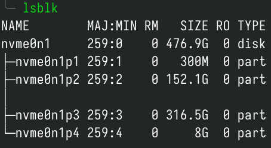
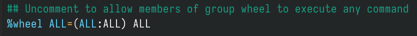

## 连接网络

### 有线网络
插上网线，等待片刻即可。
### 无线网络
- 输入```iwctl```回车进入无线网络工具，依次执行如下命令。
```bash
device list #列出无线网卡（一般来说是 wlan0）
station wlan0 scan #扫描无线网络
station wlan0 get-networks #列出所有可用的无线网络
station wlan0 connect SSID #SSID 即为 Wi-Fi 名称，可输入一部分然后按 Tab 键补全
```
- 输入密码后回车，然后执行 exit。  
注意：要连接名称里带空格的网络，连接时要用双引号将网络名称括起来。
- 测试网络是否正常连接
执行
```bash
ping archlinux.org -c 3
```
即可测试与 Arch Linux 服务器是否正常连接。（-c 后面的数字表示连接的次数）

## 配置ssh（可选）
1. 设置root密码
```bash
passwd               # 设置root密码（后续SSH登录需用）
```
2. 配置远程连接
- 修改配置文件允许root登录：
```bash
nano /etc/ssh/sshd_config
```
- 取消注释或添加以下行：
```nash
PermitRootLogin yes
```
- 重启SSH服务：
```bash
systemctl start sshd
```
- 获取本机IP
```bash
ip a
```
3. 通过SSH远程连接  
在另一台电脑使用SSH客户端（如PuTTY、MobaXterm）连接：
```bash
ssh root@<IP地址>  # 输入root密码登录
```
***注意：若连接失败，检查防火墙或网络配置***

## 与互联网同步日期时间
执行
```bash
timedatectl set-ntp true
```
即可同步。  
可以使用 timedatectl status 检查服务状态。
## 建立与格式化硬盘分区（使用 Btrfs 文件系统）
1. 执行 lsblk 查看硬盘详情。  
   
图中所示是我的硬盘，最左边 nvme0n1 是硬盘设备名，下面的 nvme0n1p1、nvme0n1p2...是分区设备名。  
***注意：硬盘命名规则***

| 硬盘类型                 | 设备文件名                |
| -------------------- | -------------------- |
| SATA 硬盘/U 盘等 SCSI 设备 | /dev/sd[a-z]         |
| NVMe 硬盘              | /dev/nvme[0-9]n[1-9] |
| 虚拟硬盘                 | /dev/vd[a-z]         |

对于 SATA 硬盘/U 盘/虚拟硬盘来说，系统采用 a~z 来代表26块不同的硬盘（默认从a开始分配）。对于 NVMe 硬盘来说，第一个数字表示控制器序号（从0开始），第二个数字表示命名空间（namespace）序号（从1开始）。但是对于消费级 NVMe 硬盘而言，一块硬盘一般只有一个命名空间，因此我们一般见到的是 ```/dev/nvme[0-9]n1```。  

2. 找到需要安装 Arch Linux 的硬盘后，执行  
```bash
cfdisk /dev/磁盘文件名
```
即可进入分区管理界面（下图是已经分好区的硬盘）
  
在分区管理界面，可以使用上、下、左、右键移动位置。

对于 Arch Linux，以下分区是必须要有的：  
一个根分区（挂载在根目录）/；  
要在 UEFI 模式中启动，还需要一个 EFI 系统分区（512MB 就完全足够了）。

**如果硬盘上原来有操作系统，安装 Arch Linux 单系统需要先删除原来的分区。删除方法：先用上下键选中要删除的分区，然后用左右键选择 Delete，回车。**

3. 创建根分区  
先用上下键选中一块空闲空间（free space），然后用左右键选择New，回车。  
First sector，保持默认即可，回车。  
Size in sectors or {KMGTP}，输入根分区的大小（建议大于 64G），以**数字+G**（如80G）的形式输入，回车。  
Hex code or GUID，默认8300是 Linux File System，保持默认即可，回车。  
Enter new partition name，输入分区名，回车。

4. 格式化硬盘分区
分区完成后，可执行 ```lsblk``` 查看分区状态。
  
找到 EFI 分区（一般在最前面，大小 100M ~ 300M）  
执行下面命令格式化 EFI 分区：

```bash
mkfs.fat -F 32 /dev/EFI分区设备名 #图中EFI分区设备名为nvme0n1p1，请根据自己lsblk的实际情况替换
```
5. 找到根分区，执行下面命令格式化根分区：

```bash
mkfs.btrfs -f /dev/根分区设备名 #图中根分区设备名为nvme0n1p2，请根据自己lsblk的实际情况替换
```

6. 创建Btrfs子卷  
为了创建子卷，需要先将上面的 Btrfs 分区挂载到 /mnt 下：
```bash
mount -t btrfs -o compress=zstd /dev/sda3 /mnt
```
命令参数说明：
- -t 指定挂载分区文件系统类型
- -o 添加挂载参数
- compress=zstd 为开启透明压缩
7. 创建 Btrfs 目录子卷：
```bash
btrfs subvolume create /mnt/@       # 创建 /     目录子卷
```
完成后可以使用以下命令检查：

```bash
btrfs subvolume list -p /mnt
```
如果显示尾部是：path @ 即为正常。

卸载```/mnt```：
```bash
umount /mnt
```
8. 挂载分区  
注意，挂载是有顺序的，需要从根目录开始挂载。使用如下命令挂载子卷：
```bash
# 挂载根目录
mount -t btrfs -o subvol=/@,compress=zstd /dev/sda2 /mnt

# 创建&挂载 /boot/efi 目录
mkdir -p /mnt/boot/efi
mount /dev/sda1 /mnt/boot/efi
```
9. 检查挂载状态  
完成后可以使用以下命令查看挂载状态：
```bash
df -h
```
其中 df -h 应该会显示如下内容：
```bash
Filesystem Mounted on
/dev/sda2  /mnt
/dev/sda1  /mnt/boot/efi
```

## 修改镜像源
执行：
```bash
nano /etc/pacman.d/mirrorlist
```
打开镜像源文件最上面添加中科大源：
```bash
Server = https://mirrors.ustc.edu.cn/archlinux/$repo/os/$arch
```
然后按ctrl+x保存并退出。

## 安装系统
执行如下命令开始安装系统：
```bash
pacstrap /mnt base base-devel linux linux-firmware linux-headers nano intel-ucode
```

### 备注
- base-devel：基础开发工具包（包括 gcc g++ make 等等）
- nano：常用的文本编辑器
- amd-ucode/intel-ucode：CPU 微码
- 稳定版linux linux-firmware linux-headers也可以安装长期支持版linux-lts linux-firmware linux-lts-headers
## 生成 fstab 文件
用以下命令生成 fstab 文件：

```bash
genfstab -U /mnt >> /mnt/etc/fstab
```

## Chroot 进入新系统

执行以下命令变更根目录，进入新系统：

```bash
arch-chroot /mnt
```

## 配置软件仓库
1. 修改```/etc/pacman.conf```：
```bash
nano /etc/pacman.conf
```
2. 添加archlinuxcn(中科大)
```bash
[archlinuxcn]
Server = https://mirrors.ustc.edu.cn/archlinuxcn/$arch
```
3. 导入密钥:
```bash
pacman -Syu archlinuxcn-keyring
```

## 设置时区

1. 执行下面命令设置 Asia/Shanghai 时区：

```bash
ln -sf /usr/share/zoneinfo/Asia/Shanghai /etc/localtime
```
2. 执行下面命令与硬件时间同步：

```bash
hwclock --systohc
```

## 本地化

1. 执行下面命令打开 locale.gen 文件：

```bash
nano /etc/locale.gen
```

2. 按键盘上的 i 进入插入模式。
往下翻找到 ```en_US.UTF-8 UTF-8```和```zh_CN.UTF-8 UTF-8```，将前面的注释符（#）删去。  
然后按CTRL+X，保存退出。  
**注意：在安装阶段不要设置中文 locale，可能导致 tty 乱码。但是在安装gnome之前必须修改，不然进入桌面环境之后很难修改中文环境**
3. 然后执行

```bash
locale-gen
```
4. 生成 locale 信息。

## Root 用户密码设置(可选)
执行下面命令设置 Root 用户密码：
```bash
passwd
```
（输入密码时不会有任何显示）

## 普通用户的创建与设置
1. 执行下面命令创建一个普通用户：

```bash
useradd -m -g users -G wheel,storage,power 用户名
```
2. 执行下面命令为这个用户设置密码：
```bash
passwd 用户名
```
3. 编辑超级用户文件：
```bash
EDITOR=nano visudo
```
4. 往下翻找到```Uncomment to allow members of group to execute any command```  
将下面一行 %wheel 前的注释符（#）删去。
  
按 CTRL+X，保存退出。

## 安装 GRUB 引导程序
1. 执行 ```lsblk``` 确保 ```/boot/efi``` 分区已正确挂载。  
然后执行下面命令安装 grub 和 efibootmgr：
```bash
pacman -S grub efibootmgr
```

2. 编辑grub文件：  
如果是双系统，需要启用 os-prober 发现其他操作系统（比如 Windows）。
```bash
nano /etc/default/grub
```

3. 将 GRUB 安装到 EFI 分区：
```bash
grub-install --efi-directory=/boot/efi --bootloader-id=Arch
```
4. 使用以下命令生成 GRUB 配置文件：
```bash
grub-mkconfig -o /boot/grub/grub.cfg
```

## 安装并配置 systemd-boot（可选）

1. 执行 `lsblk` 确保 `/boot` 分区已正确挂载。

2. 安装 systemd-boot
```bash
bootctl install
```

3. 配置引导加载项

编辑 /boot/loader/loader.conf：
```bash
default arch.conf
timeout 0         # 0表示直接启动
editor no
```

4. 创建 /boot/loader/entries/arch.conf：
```bash
title   Arch Linux
linux   /vmlinuz-linux
initrd /intel-ucode.img    # 如果安装的是AMD CPU，替换为/amd-ucode.img
initrd  /initramfs-linux.img
options root=UUID=<根分区UUID> rw rootflags=subvol=@,compress=zstd
```
- 使用 blkid /dev/sda2 获取根分区的 UUID。

5. 双系统配置（可选）  
若需引导Windows：  
- 手动添加Windows引导条目：
```bash
nano /boot/loader/entries/windows.conf
```
- 内容示例：
```bash
title Windows
path /EFI/Microsoft/Boot/bootmgfw.efi
```

## 网络、蓝牙与声音
执行下面命令安装网络相关工具：
```bash
pacman -S networkmanager dhcpcd
```
执行下面命令启用网络服务：
```bash
systemctl enable NetworkManager
```
如果你用的是有线网络，执行下面命令启用 dhcpcd：
```bash
systemctl enable dhcpcd@eno2
```
执行下面命令安装蓝牙、声卡驱动和其他工具：
```bash
pacman -S bluez bluez-utils pipewire-pulse pipewire-alsa pipewire-jack paru
```
- 此处使用了新一代声音服务器 PipeWire，延迟比 PulseAudio 更低。
如果电脑有蓝牙功能，执行下面命令启用蓝牙：
```bash
systemctl enable bluetooth
```

## 显卡驱动

### Intel 核显
执行下面命令安装```Intel``` 核显驱动：
```bash
pacman -S mesa intel-media-driver
```
注意，只有第三代及以上 CPU 核显才支持 vulkan。
### 英伟达显卡
执行下面命令安装```NVIDIA```显卡驱动：
```bash
pacman -S nvidia nvidia-utils nvidia-prime
```
使用```prime-run```切换英伟达显卡。

## 安装gnome桌面
```bash
pacman -S gnome-shell gdm gnome-control-center gnome-settings-daemon gnome-console nautilus gnome-keyring gnome-system-monitor gvfs gvfs-dnssd gnome-backgrounds loupe gnome-text-editor decibels gnome-tweaks ibus ibus-libpinyin
```

## 开机自启```gdm```界面:
```bash
systemctl enable gdm
```

## 安装常用软件
```bash
pacman -S firefox mpv noto-fonts-emoji
```

## 安装完成，重启进入 Arch Linux
执行下面命令退出 Chroot：
```bash
exit
```
取消挂载 /mnt 下的所有分区：
```bash
umount -R /mnt
```
关机：
```bash
poweroff
```
拔掉安装U盘，开机。

## gnome拓展管理器
```bash
paru -S extension-manager
```
